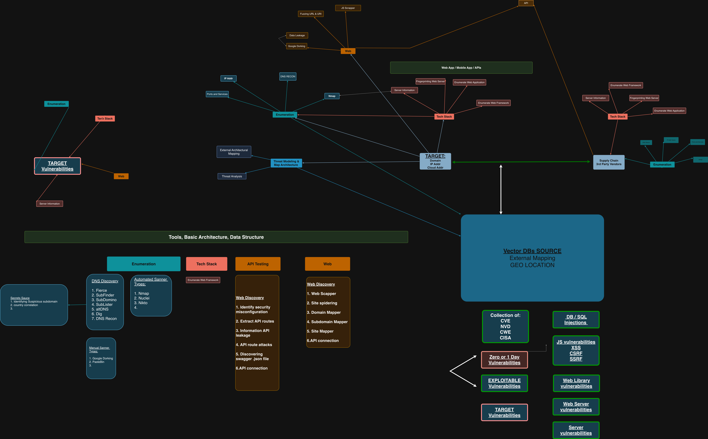

# ROADMAP - SIGHT AND VISION TO "PROJECT CONTEXT-CLUES"

# UnrealSec the founders of Project Context-Clues

UnrealSec is a cybersecurity-focused organization dedicated to transforming how enterprises operationalize and secure their data in an increasingly 
AI-driven threat landscape.

Our mission is to modernize cybersecurity operations by vectorizing corporate data, enabling organizations to unlock deeper contextual intelligence across 
their environments. By converting unstructured data sources such as logs, tools reults, telemetry, threat intelligence, and asset inventories into 
high-dimensional embeddings. This will empower security teams to move beyond traditional analysis toward a more dynamic, correlation-driven approach.

At the core of our approach is to integration of vector databases within secure, air-gapped AI-driven architectures. This design ensures that organizations 
can leverage advanced AI capabilities such as similarity search, behavioral clustering, and context-aware threat detection—without compromising sensitive 
data or exposing critical systems to external risk.

UnrealSec enables security teams to identify patterns, detect anomalies, and uncover hidden relationships across their attack surface with greater speed 
and precision. By combining vectorization, visualization, and AI-driven analytics, we provide a next-generation foundation for proactive threat hunting, 
adversary emulation, and operational resilience.

Our goal is to redefine CyberOps by delivering secure, scalable, and intelligent solutions that align with the evolving demands of modern cybersecurity.

## Project Context Clues Purpose:
Modern cyber operations generate massive, high‑dimensional data, alerts, asset inventories, scan results, DNS and
TLS telemetry, threat intel feeds, and more. Most teams still force this data into legacy, row‑and‑column patterns that were
never designed for AI‑driven analysis. This talk presents a practical approach to modernize, vectorize, and visualize your
cyber operations data using the Qdrant vector database as the core of a next‑generation threat intelligence and recon platform.

## Abstract about Project Contexxt Clues:
We will walk through how to transform heterogeneous cyber data (from tools like Nmap, Amass, sslscan, passive DNS, and OSINT
sources) into embeddings that capture semantic relationships-between assets, indicators, behaviors, and attack paths-instead of just static fields. Once vectorized, Qdrant enables fast similarity search, context‑aware pivoting (e.g., “find assets that behave like this compromised host”), and automated clustering for campaign or infrastructure grouping. On top of that, we will show how to leverage Qdrant’s filtering and metadata capabilities to combine classic threat hunting (by IP, ASN, tags, exposure) with vector search workflows. Building a small open‑source CyberOps data pipeline around Qdrant
as an air-gap AI-driven system. By mapping external attack surface posture into vectors that enable visualizing the nearest neighbors of risky assets using dimensionality reduction and graph‑style views to support Red Teamer, Blue Teamer, and Threat Modeling. By using our framework, user will harness the capabilities of concrete patterns, schema ideas, and code‑level concepts they can immediately apply to replace brittle dashboards and ad‑hoc spreadsheets with a scalable, AI‑ready, vector‑driven threat intel backbone.

Start DATE Sept.2025
